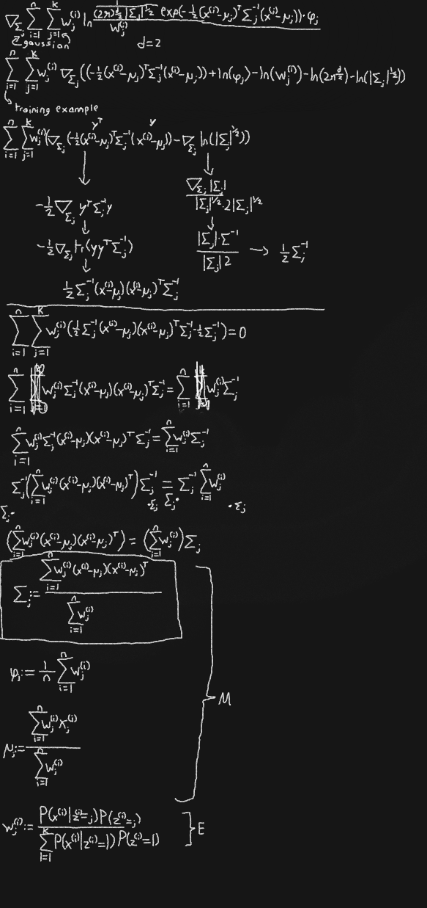

An Expectation Management based Mixture of Gaussians model made from scratch.

Negative Log Likelihood of about 1.2 with 3 gaussians

Derivation for the covariance update rule (the others were provided by my goat andrew ng)

